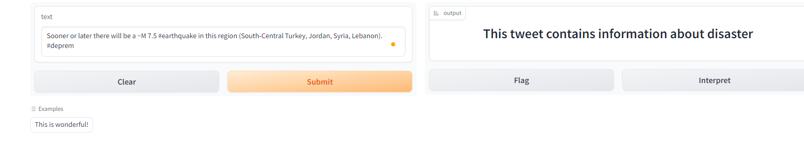

# Disaster Detection Repository

Welcome to the Disaster Detection Repository. This repository is dedicated to a project focused on disaster detection.
Here, you will find information about the project, its requirements, and how to display the demo.

## Table of Contents
1. [Description](#description)
2. [Requirements](#requirements)
3. [Installation](#installation)
4. [Training the embeddings ](#train_model)
5. [Training the classification model](#train_classification)
6. [Results of experiments](#results)
7. [Gradio Demo](#gradio_demo)

## 1. Description <a name="description"></a>

The Disaster Detection project aims to develop a system for detecting and monitoring disasters such as earthquakes, floods, 
wildfires, and more. For this problem, in this reposetory, we will use a social media posts, that contain or not disasters,
to provide timely and accurate information to authorities and the public. This repository contains the dataset related to the project.

## 2. Requirements <a name="requirements"></a>

To contribute or run this project locally, you will need the following prerequisites:

- Python 3.x
- Data sources. Load data from this [link](https://drive.google.com/file/d/1TKVEprgfgfOv6tWY5DzYvEbVJZTf7J9v/view?usp=sharing). Unzip it to the root of the project.
- Checkpoint. Load checkpoint of the BERT model from [here](https://drive.google.com/file/d/1Jfr_qlGQYKGgDKZ6Qd4eWtKEnRjk6nEn/view?usp=sharing). Unzip it to the root of the project.
- Checkpoints of the models. Load checkpoint of the models from [here](https://drive.google.com/file/d/1rQx2ucz05kkbTgxBY0DJGSN9OfzHw4qZ/view?usp=sharing).
- Additional dependencies as specified in the project's documentation

## 3. Installation <a name="installation"></a>

To install and set up this project on your local machine, follow these steps:

1. Clone the repository:

   ```bash
   git clone https://github.com/OleksandrZhytnyk/disaster_detection.git

2. Create the new environment 

   ```bash
   conda create -n des-detection python=3.9 anaconda

3. Activate the environment 

   ```bash
   conda activate des-detection
   
4. Install all dependencies of the project

   ```bash
   pip install -r requirements.txt

## 4. Training the embeddings <a name="train_model"></a>

To create embeddings of the messages, we will train the BERT model for 3 epochs.

   ```bash
   python main.py --save_dir ./checkpoint --model_name bert-base-cased --device cuda --max_length 384 --csv_path data/train.csv
   ```

The accuracy on the validation dataset at the end of the training is reported to be 0.81, indicating the model's performance.

You can create datasets based on the embeddings of the BERT model using the following command:

   ```bash
   python .\preprocessing\preprocessing.py --save_path data/train_emb.csv --model_path .\checkpoint\ --max_length 384 --csv_path data/train.csv 
   ```

This command will create a dataset containing embeddings of the messages. All the embeddings will be stored in the **data/train_emb.csv**
file. The process of creating will take around 6-7 min.

**Note**: You can skip 2 previous step (training BERT and creating embeddings), as you will have model and csv file in repository.  
## 5. Training the classification model <a name="train_classification"></a>
In this section, we will train five different models based on the embeddings created from the data.
These models are selected for experimentation to assess their performance on the task at hand.
* Models Included in the Experiment:
1. Logistic Regression: A simple yet effective linear model for classification tasks.
2. Random Forest: A powerful ensemble learning method that combines multiple decision trees.
3. Dense Neural Network (NN) Model: A feedforward neural network with multiple hidden layers.
4. Long Short-Term Memory (LSTM) Model: A type of recurrent neural network (RNN) known for handling sequential data.
5. Gated Recurrent Unit (GRU) Model: Another type of recurrent neural network, similar to LSTM but with a simpler architecture.

Each of these models will be trained and evaluated on the provided dataset to assess their performance and suitability for the task.

Here is example of runing the training for NN model. You also can run others model, just change 
path of the execution file and change the **model_name** (it is parameter for saving model name).
   ```bash
   python custom_models/custom_nn.py --save_dir ./custom_models --model_name densenn --csv_origin_path data/train.csv --csv_emb_path data/train_emb.cs 
   ```

## 6. Results of experiments <a name="results"></a>
Here is the results of the experiment:

| Model       | Accuracy on Validation Data |
|-------------|-----------------------------|
| LR          | 0.8902                      |
| RF          | 0.9112                      |
| Dense NN    | 0.9154                      |
| GRU         | 0.9049                      |
| LSTM        | 0.9104                      |

As you can see, we get the best result using Dense NN.

## 7. Gradio Demo <a name="gradio_demo"></a>

It is the time to check the ability of the model to classify the massages that may have an information of desister.
For the real case message we will take this [tweet](https://twitter.com/hogrbe/status/1621479563720118273) about earthquake.

To run gradio demo: 

   ```bash
    python disaster_demo.py --model_name nn --model_path ./checkpoint --max_length  384        
   ```

and in the opening window (after running the command you should see the link to the localhost) you will have the line,
where you need to pass the massage.

